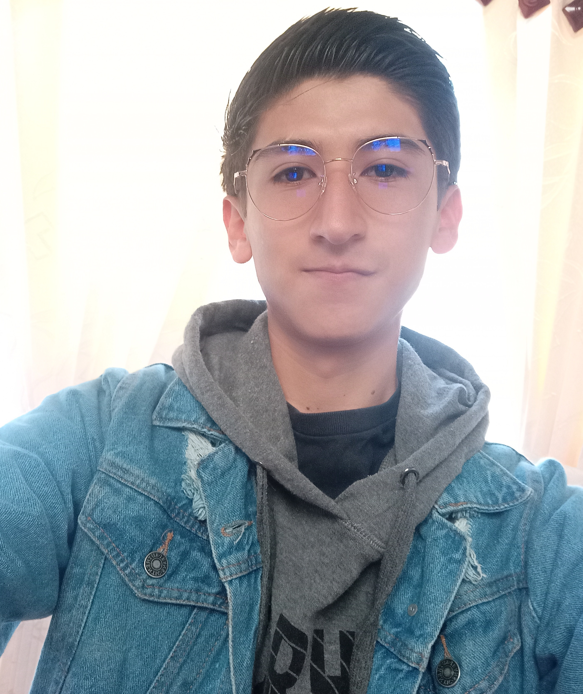

## Integrantes

# Alejandra Superlano

    

Soy estudiante de Ingeniería de Sistemas y Computación de 10mo semestre. Mis intereses concernientes a la ingeniería se centran en el desarrollo del backend de aplicaciones web utilizando `Java` con el framework Spring Boot y el desarrollo de algoritmos de aprendizaje de máquina con el uso de librerías de Python. Como pasatiempos o intereses personales me gusta el estudio de la teoría musical, hacer manualidades, cantar y jugar videojuegos.

# Santiago Rodríguez

    

Soy estudiante de Ingeniería de Sistemas y Computación de 9no semestre. Entre mis principales intereses respecto a la carrera se encuentra el desarrollo web enfocado en front-end en frameworks como Angular y React Js. Por otro lado me interesa el campo back-end (relacionado a node.js) para que de este manera pueda tener un conocimiento full-stack. En cuanto a mis pasatiempos principales, me gusta leer sobre la historia, la filosofía y la poesía; me gusta bailar ritmos latinos y escribir. 

# Anderson Vargas

    

Soy estudiante de Ingeniería de Sistemas y Computación de 10 semestre. Profesionalmente me siento atraído principalmente por la ingeniería de software, así mismo tengo un alto interés en la arquitectura de software, por lo que mis mayores conocimientos se concentran en la creación de software haciendo uso de tecnologías como bases de datos relacionales y no relacionales, frameworks de desarrollo web por ejemplo Spring boot y Laravel. Otra área de mi gusto es la inteligencia artificial, aunque solo tengo conocimientos básicos. En cuanto a intereses personales destaco el gusto por el ajedrez y el dibujo o pintura a mano.

